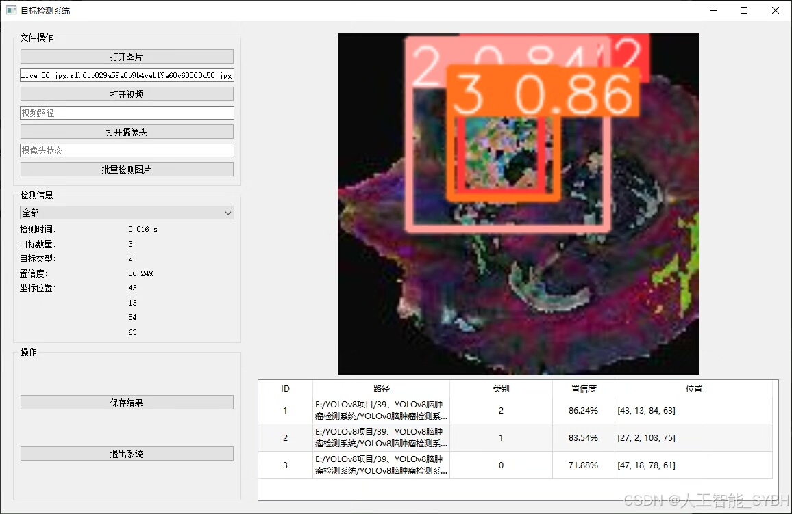
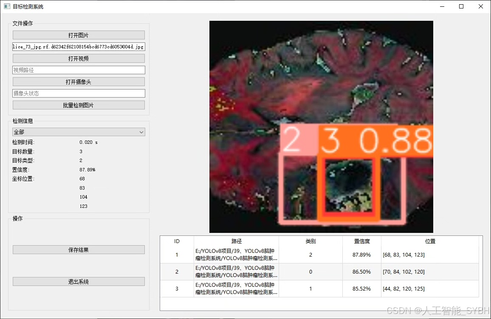
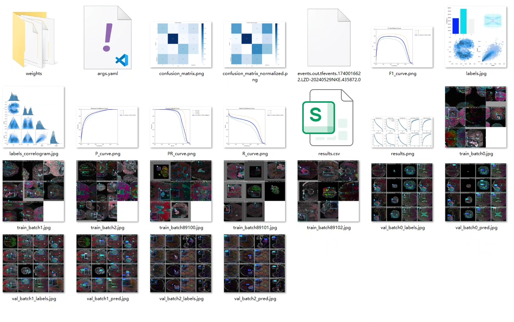
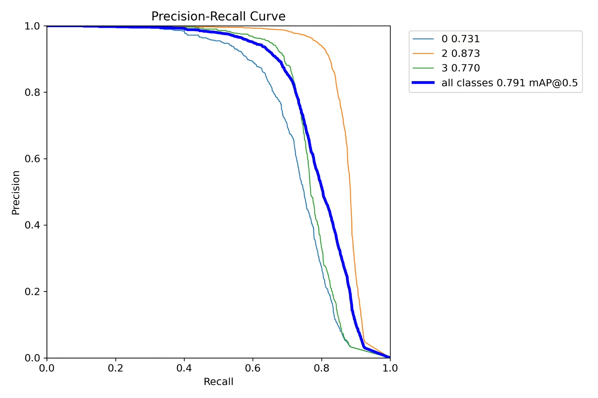
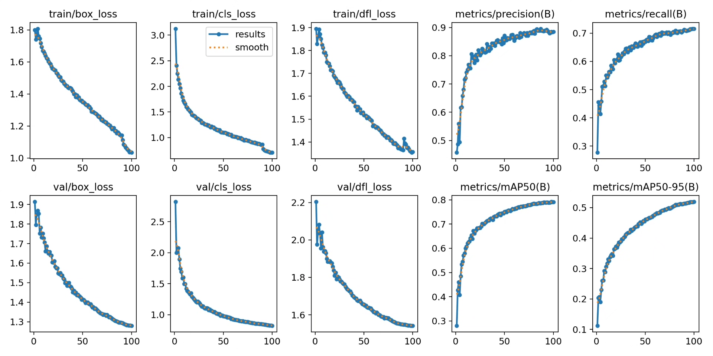
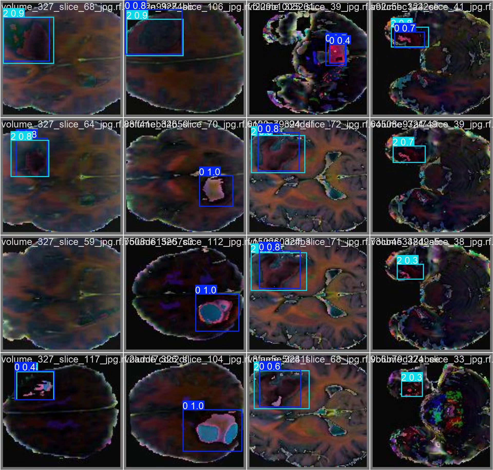
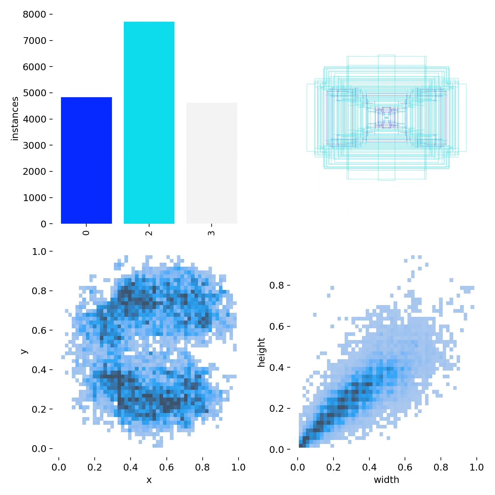
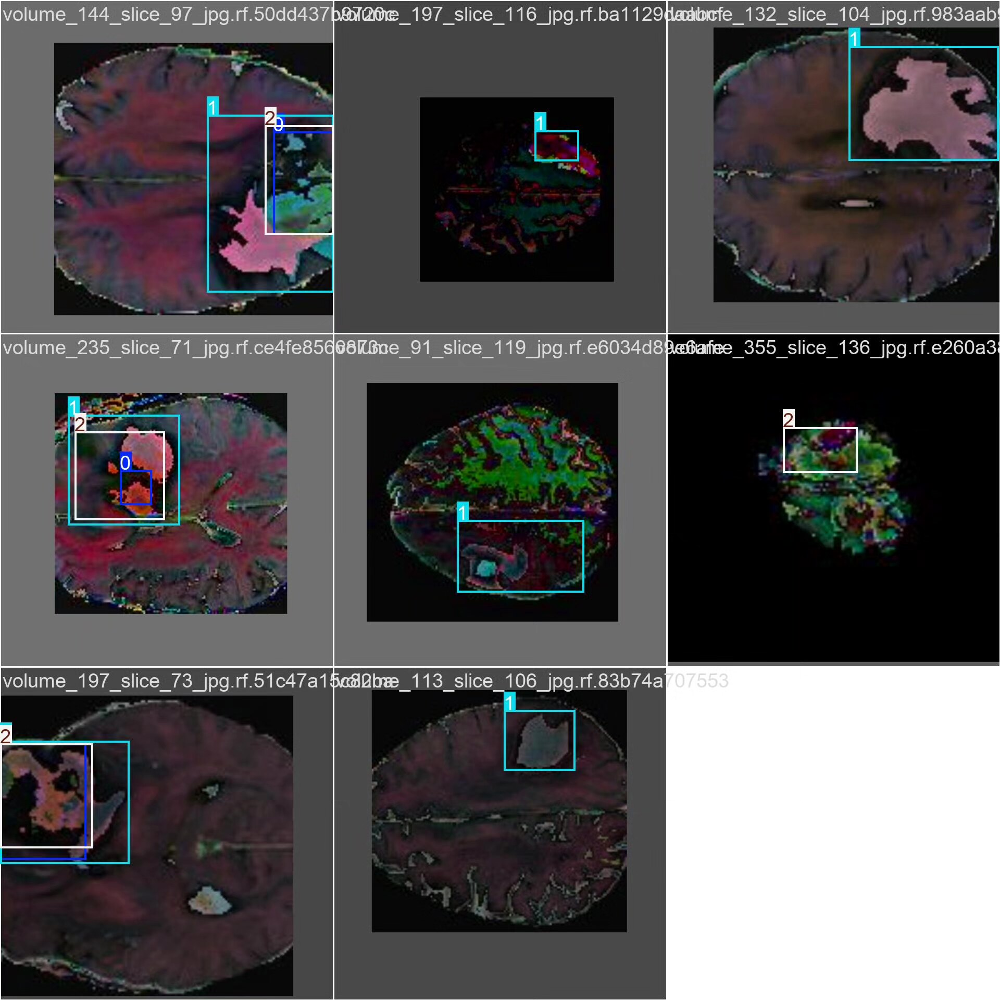

# Brain tumor detection system based on YOLOv8 deep learning (YOLOv8+YO)

## Body

This project is based on the YOLOv8 deep learning algorithm to develop a high-efficiency and high-accuracy brain tumor detection system. It is used for brain tumor recognition and classification in medical imaging (such as MRI, CT, etc.). The system can detect three types of brain tumors (category labels: ["0", "2", "3"]), which are suitable for assisting doctors in rapid and accurate screening and diagnosis of brain tumors. The dataset contains 9900 medical images, including 7920 training sets and 1980 validation sets, ensuring that the model has strong generalization capabilities.

The company's products have obtained the official commercial license certification from YOLO.

We provide after-sales service.

After payment, we will provide WeChat IDs, answering questions anytime.

Environment configuration: We will provide an environment configuration tutorial, and WeChat provides Q&A.

Remote installation service: If you need remote configuration, additional fees apply at 69, with all fees refunded if the configuration fails (only refund installation fees for special old computers).

Retraining dataset: After configuring the environment, you can train on your own computer. If you need us to retrain, just pay 69 + computing power fees (2.5 yuan/hour).

Full after-sales service

## Images

## Payment

Here is a pay link on Stripe ( https://buy.stripe.com/3cs8yP7sY87d0vu9AB ). Please contact me lonlonago@foxmail.com after funding $89, and I will send you a complete data files , thank you!

